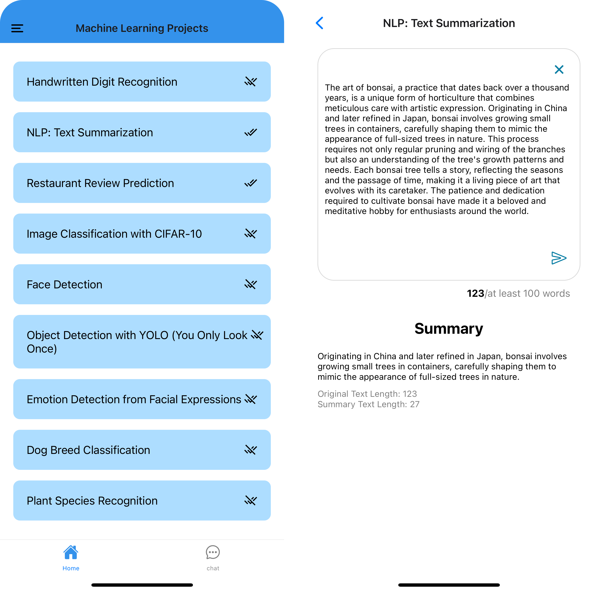

# Machine Learning Projects with Expo

<!-- list the project with link of code -->

**NPL: Text summarization** ->[code](https://github.com/LeahDeshar/Expo-ML/blob/master/server/textsummary/main.ipynb)

<!-- insert link -->

## Output

## Technologies Used

- **Frontend:**

  - Expo React Native
  - React Navigation (for navigation)
  - Axios (for HTTP requests)

- **Backend:**
  - FastAPI (Python framework)
  - scikit-learn (for machine learning model)
  - joblib (for model serialization)
  - pandas (for data manipulation)
  - other
